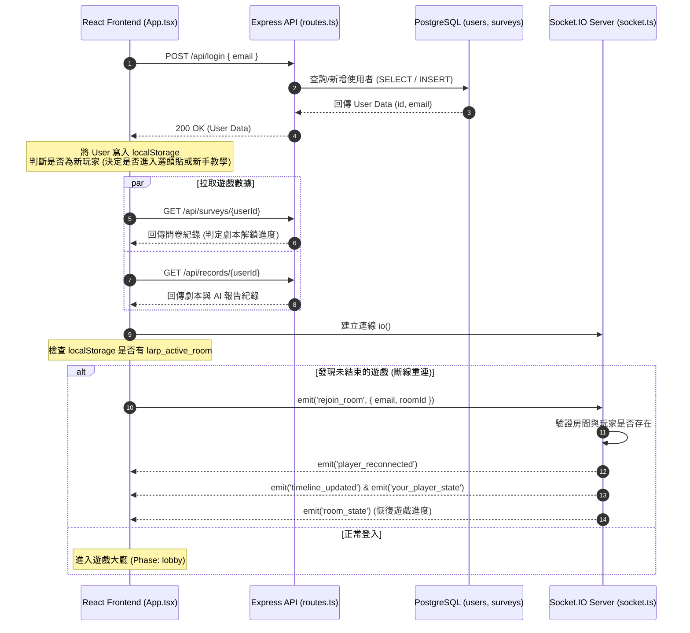
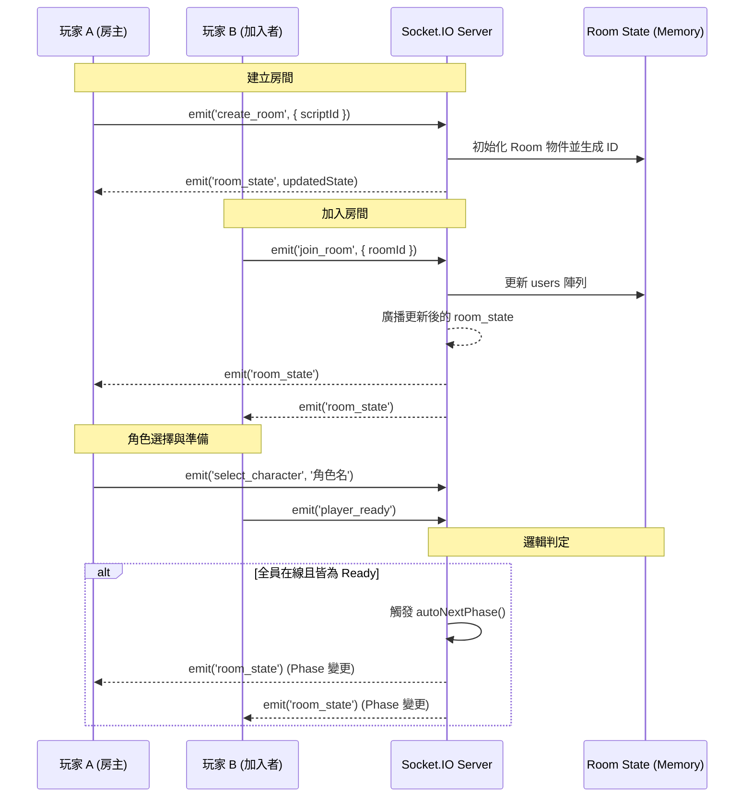
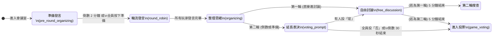
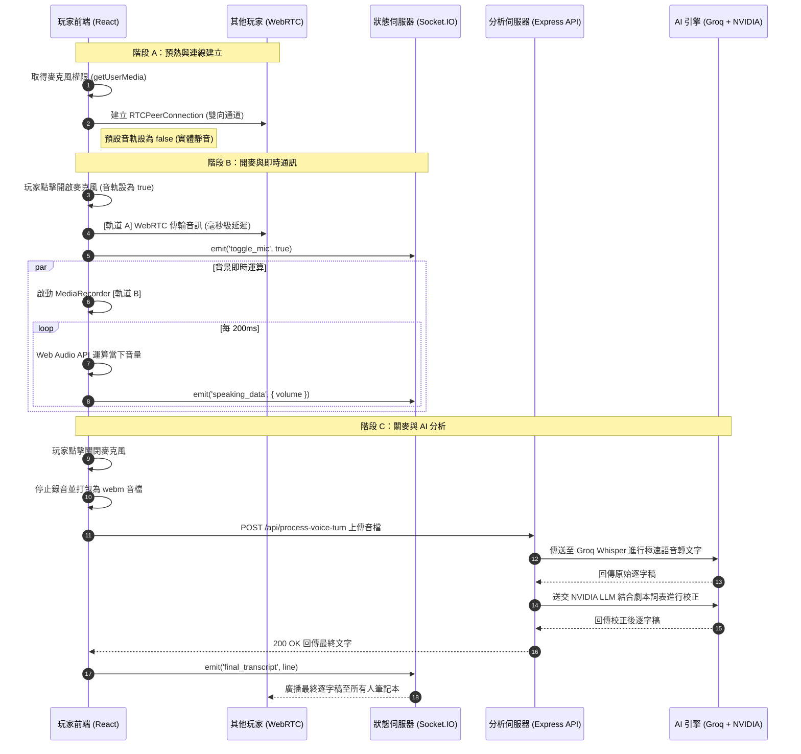
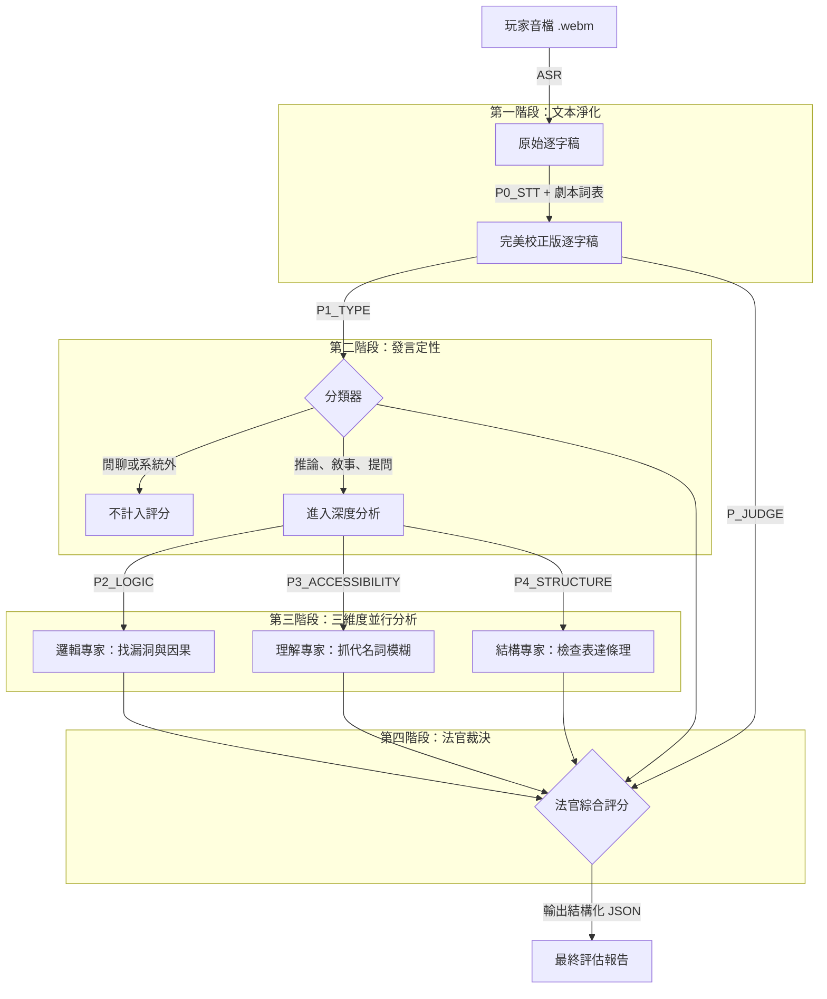
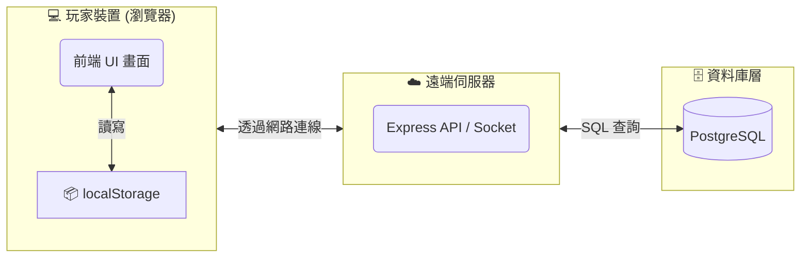

<div align="center">

</div>

# Run and deploy your AI Studio app

This contains everything you need to run your app locally.

View your app in AI Studio: https://ai.studio/apps/f98f781d-d418-4417-802f-40360091d54f

## Run Locally

**Prerequisites:**  Node.js


1. Install dependencies:
   `npm install`
2. Set the `GEMINI_API_KEY` in [.env.local](.env.local) to your Gemini API key
3. Run the app:
   `npm run dev`

瀏覽 http://localhost:3000/admin 進入後台
登入金鑰：admin-secret-2024（可在 server.ts 修改）
每次使用者離開會議室，對話紀錄和評估報告會自動儲存

# 系統架構
### 登入與初始化流程架構 (Login & Initialization)
當玩家打開應用程式並輸入 Email 時，系統的資料流動如下：

1. 身分驗證與建檔：前端發送 API 請求，後端在 PostgreSQL 中進行 UPSERT 邏輯（有則更新最後登入時間，無則建立新玩家）。

2. 歷史資料預載：登入成功後，前端會立刻拉取該玩家的「歷史問卷」與「遊戲/分析紀錄」，這決定了後續 UI 的解鎖狀態（例如是否解鎖劇本二）。

3. 即時連線建立：初始化 Socket.IO 連線。

4. 斷線重連機制 (Reconnection)：前端會檢查 localStorage 是否殘留未結束的 roomId。若有，主動向 Socket 發送 rejoin_room，後端驗證後會下發最新的 room_state 與 player_states 幫助玩家無縫恢復遊戲畫面。

#### 登入流程 Mermaid 循序圖 (Sequence Diagram)


### 房間系統 (Room System)

1. 房間資料結構 (Data Schema)
在後端 socket.ts 中，Room 被定義為一個複雜的物件，負責維護所有即時狀態：

   - 基礎資訊：包含 id、scriptId（劇本 ID）與 status（waiting 或 playing）。

   - 成員管理：

      - users：儲存 RoomUser 陣列，記錄玩家的連線狀態、是否準備、房主權限以及分配的角色。

      - meetingUsers：專為 WebRTC 語音設計的清單，記錄麥克風狀態與是否為 AI 託管。

   - 遊戲進度 (Game State)：

      - phase：當前階段（例如 room_lobby, game_search, game_meeting）。

      - phaseEndTime：階段結束的毫秒時間戳，用於全域倒數計時同步。

#### 房間生命週期與序列圖
房間的運作遵循嚴格的序列：建立/加入 -> 角色分配 -> 準備就緒 -> 階段切換。


2. Socket.IO Server (即時通訊伺服器)
這就是你的 Node.js 後端程式（具體來說是 socket.ts 這支檔案）。

- 它的角色：就像是一個「總機」或「交通警察」。前端（React）會透過網路連線到這個 Server。它負責接收來自各個玩家的動作（例如：加入房間、開啟麥克風、投票），然後再把更新後的狀態廣播給房間裡的其他玩家。

- 為什麼是後端：因為它是跑在雲端主機或伺服器上，負責統籌和驗證所有來自客戶端（瀏覽器）的請求，確保沒有人可以作弊，並維持遊戲秩序。

3. Room State (Memory) (記憶體中的房間狀態)
這也是存在於後端伺服器的記憶體（RAM）中。

- 它的角色：在 socket.ts 裡面，有一行程式碼類似這樣：const rooms = new Map<string, Room>();。這就是 Room State。它記錄了當前所有正在進行的遊戲房間的即時資訊（誰在哪個房間、現在是哪個階段、輪到誰發言等）。

- 為什麼放記憶體，而不是放資料庫 (PostgreSQL)？：
因為即時遊戲的狀態改變得太快了！如果玩家每開關一次麥克風，或是計時器每一秒的倒數，都要去讀寫硬碟裡的 PostgreSQL 資料庫，伺服器會因為來不及處理而卡頓。
因此，後端會把這些「需要極速讀寫、且暫時性」的狀態放在 RAM (Memory) 裡面，等到一個大階段結束（例如：整局遊戲結束產生對話紀錄時），才會把最終結果寫入 PostgreSQL 永久保存。

簡單總結：前端（React）只負責「顯示畫面」和「發送使用者的操作」。所有的「遊戲規則判定（Socket.IO Server）」和「當前遊戲進度暫存（Room State Memory）」都是在後端緊密運作

## 階段切換機制
1. 全員共識驅動 (Ready-Driven)
這就是我們剛剛討論的標準模式。大家必須都按下「準備好了，下一步」，伺服器才會呼叫 autoNextPhase 推進到下一關。

- 適用階段：room_lobby 、 character_preview 

- 後端邏輯：玩家觸發 player_ready，當 room.readyUsers.size >= playingCount 時切換。

2. 伺服器強制倒數 (Time-Driven)
劇本殺不能讓玩家無限期卡在某個階段，因此一旦進入搜查或閱讀階段，後端會啟動定時炸彈 (phaseTimeout)。時間一到，就算有人還沒按準備，伺服器也會強制把你拉進下一個階段。

- 適用階段：game_profile 、 mission_briefing、game_search (預設 300 秒)、diary_reveal (劇本二專屬的 270 秒閱讀時間)。

- 後端邏輯：在 startPhase 中設定 setTimeout，時間到直接執行 autoNextPhase 或強制跳轉。前端的倒數計時只是視覺效果，真正的生殺大權在伺服器手裡。

3. 房主/劇情控制 (Host-Driven)
有些階段是跟著「戲劇演出 (Act)」走的，或是需要房主來推動進度，而不是看全員準備狀態。

- 適用階段：幕演出

- 演出切換：房主觸發 start_act ➔ 大家看完 ➔ 房主觸發 end_act ➔ 自動跳轉搜查。

- 結局結算：房主按下按鈕觸發 start_ending_phase，強制所有人進入勝負結算畫面。

4. 絕對隔離的個人切換 (Personal Override)
這是系統中最特別的例外！當遊戲徹底結束，進入「真相大白 (truth_revealed)」階段時，系統打破了房間必須同步的規則。

- 適用場景：有人看真相看得很慢，有人看很快想先退房。

- 後端邏輯：當玩家點擊進入真相大白時，前端會發送 start_truth_phase。後端不會廣播 room_state，而是使用一個專屬事件 socket.emit('personal_phase_override', { phase: 'truth_revealed' })。

- 為何這樣設計：這保證了已經在看真相的玩家，不會因為其他玩家離開導致房間狀態變更，而突然被踢出去。

## 「會議微狀態機」 與 「WebRTC 雙軌語音架構」
#### 會議室的「微狀態機」 (The Meeting Micro-State Machine)
當房間進入 phase: 'game_meeting' 後，大階段 (phase) 就不再變動了。系統將控制權交給了 socket.ts 中的 meetingStage。這是一個混合了「強制倒數定時器」與「玩家手動準備 (meeting_ready)」的雙重驅動狀態機。


#### 輪流發言 (round_robin) 的核心機制：

- 發言權控制 (currentSpeakerIndex)：伺服器會維護一個當前發言者的索引。前端的 App.tsx 會監聽 meeting_state，如果發現 currentSpeaker?.id !== socket.id，前端會強制切斷該玩家的麥克風實體收音 (track.enabled = false)，防止搶話。

- 靜音防呆 (silenceCheckInterval)：後端每秒會檢查當前發言者。如果前端超過 10 秒沒有發送 user_speaking 事件（代表麥克風沒收到音量），後端會下發 silence_warning，觸發前端 5 秒的紅色倒數警告彈窗。時間一到若仍無聲音，直接跳過該回合 (nextTurn)。

#### 雙軌語音架構：WebRTC (即時聽) + MediaRecorder (AI 分析)

這個應用的語音處理架構非常高級。為了同時滿足「玩家之間通話零延遲」與「AI 需要完整高音質片段來做逐字稿與分析」，前端 App.tsx 將麥克風的媒體流 (localStreamRef.current) 兵分兩路：

##### A 軌道：WebRTC 點對點網狀網路 (Mesh Network)
這條路負責讓玩家互相聽到聲音。

1. 預熱機制 (Pre-warming)：只要進入可能需要語音的階段（例如角色預覽），系統就會提早向瀏覽器索要麥克風權限 (getUserMedia) 並建立 AudioContext，但先將軌道設為 enabled = false。

2. 防閃爍 (Signaling Glare Prevention)：建立 PeerConnection 時，直接使用 pc.addTransceiver('audio', { direction: 'sendrecv' }) 強制打通雙向音訊通道。

3. 無縫開關麥：當玩家點擊開麥克風時，不需要重新發送 Offer/Answer 協商（這會造成卡頓），而是直接使用 sender.replaceTrack(track) 將實體收音軌道塞進已經建好的通道中，實現毫秒級的開關麥。

##### B 軌道：MediaRecorder 錄音與 STT
這條路負責將語音轉換為精準的文字，供後續 LLM 分析。

1. 鎖定回合：當 isMicOn 變為 true 且處於 game_meeting 階段，啟動 MediaRecorder。在啟動瞬間，利用 Closure（閉包）鎖定當下的 round 與 startTimestamp。

2. Timeslice 切片：設定 mediaRecorder.start(1000)，每秒產出一個 chunk。這確保了即使網路閃斷或瀏覽器崩潰，已經錄下的音檔也不會遺失。

3. Opus 編碼上傳：關麥時，將 chunks 打包成 webm/opus 格式的 Blob，並透過 FormData 發送到後端 /api/process-voice-turn。

##### 即時音量與語速回饋
在發言時，下方儀表板會跳動音量條並顯示 CPM (每分鐘字數)，這是怎麼做到的？

1. 音量條 (currentVolume)：前端利用 Web Audio API 的 AnalyserNode。每 200ms 執行一次 Fast Fourier Transform (FFT)，算出當下頻率陣列的平均值。如果平均值大於 10，就透過 Socket 發送 speaking_data 讓其他人看到你在說話。

2. 語速計 (currentCPM)：每 3 秒計算一次 subtitles 陣列最後一句話的字數，並回推成 60 秒的字數比例。



如果高精準度的 AI（Groq + NVIDIA）是在玩家「關閉麥克風」後才整包上傳音檔去分析的，那發言當下儀表板上的「即時語速 (CPM)」和「畫面上的即時字幕」到底是哪裡來的？

答案隱藏在前端的 useSubtitles.ts 裡面。這套系統其實實作了「雙層語音辨識 (Two-Tier ASR) 架構」，它不只語音兵分兩路，連「文字」也是兵分兩路的：

##### 第一層：瀏覽器內建的 Web Speech API (打草稿與算語速)
為了達到真正的「零延遲」視覺回饋，前端在玩家開麥克風的當下，除了啟動錄音，還同時呼叫了瀏覽器原生的 SpeechRecognition (Web Speech API)。

- 特性：它是免費的、直接在玩家的設備（或瀏覽器底層）運算，文字幾乎是邊講邊吐出來的。

- 用途：

   1. 產生 liveCaptions（即時字幕）。這就是畫面上會不斷跳動、修正的暫時性文字。

   2. 計算 CPM (每分鐘字數)。前端就是拿這串即時吐出來的 liveCaptions 字數，每 3 秒去推算一次語速儀表板。

- 缺點：精準度普通，且不懂劇本裡的專有名詞。

##### 第二層：Groq + NVIDIA 引擎 (最終定稿與 AI 分析)
這就是我們剛剛提到的「B 軌道」。當玩家講完話、關閉麥克風的那一刻：

- 覆蓋機制：後端處理完那包高品質的 .webm 音檔，並經過 NVIDIA 的劇本詞表校正後，會透過 Socket 廣播 final_transcript 回來。

- 狀態切換：在 useSubtitles.ts 的 appendFinal 函式中，你會看到一個很精妙的操作：
```tsx
// 當收到最終高品質文字時
setFinalSubtitles(prev => [...prev, line]); // 把完美文字塞進最終陣列
delete next[speaker];                       // 🌟 同時把剛剛 Web Speech 產生的粗糙 liveCaption 刪除！
```

## 多 Agent 協作法官
為了達到「專業 AI 法官」的水準，你的 engine.ts 與 prompts.ts 實作了非常經典且強大的 「多 Agent 協作管線 (Multi-Agent Pipeline)」 與 「思維鏈拆解」 策略。

我們把這個 AI 引擎拆解成 「模型調度」、「五步分析管線」 與 「防呆機制」 三個核心來看。

1. 多模型協同作戰 (Model Orchestration)
打開 prompts.ts 的 MODELS 常數，可以看到你非常精明地根據任務特性，把工作分配給了最適合的模型，而不是全部砸給同一個：

極速聽寫 (ASR)：交給 deepgram/nova-2 (或 Groq Whisper)，專注於最快把音檔轉成粗糙的文字。

上下文校正 (P0_STT)：交給速度極快、便宜的 Llama 3，搭配 entity.ts 裡定義的「劇本專屬詞表 (glossary)」（例如：新亭洞、崔製作人），把 ASR 聽錯的同音字修回來。

深層邏輯推理 (Judge)：交給具備強大推理能力的 Nvidia Nemotron 或是 Qwen。這些模型（可能帶有 <think> 思維鏈能力）負責最複雜的邏輯糾錯與給分。

2. 核心大腦：五步分析管線 (The 5-Step Analysis Pipeline)
在 prompts.ts 開頭的註解完美詮釋了這個管線的流轉。這是 engine.ts 中 analyseSession 函式的底層邏輯



## 結局結算：資料持久化與 API 路由 (routes.ts & db.ts)
遊戲結束後，記憶體 (Room State) 裡的資料會灰飛煙滅，這時候就需要 REST API 與 PostgreSQL 登場了。

- 資料庫綱要 (db.ts)：
你設計了四個核心表：users (玩家基本資料)、surveys (問卷紀錄，作為解鎖劇本的依據)、script_records (對話紀錄) 以及 assessment_reports (AI 評估報告)。

- API 路由 (routes.ts)：
當 AI 分析引擎背景跑完後，會呼叫 db.query 將最終的 JSON 報告寫入 assessment_reports 表。前端會透過 polling (輪詢) 或是在查看報告頁面時發送 GET /api/reports/:userId，將熱騰騰的 AI 報告拉回前端展示給玩家。

- 甚至還有一個隱藏的 /admin/users 路由，能讓管理者查看所有玩家的遊玩軌跡與問卷。

